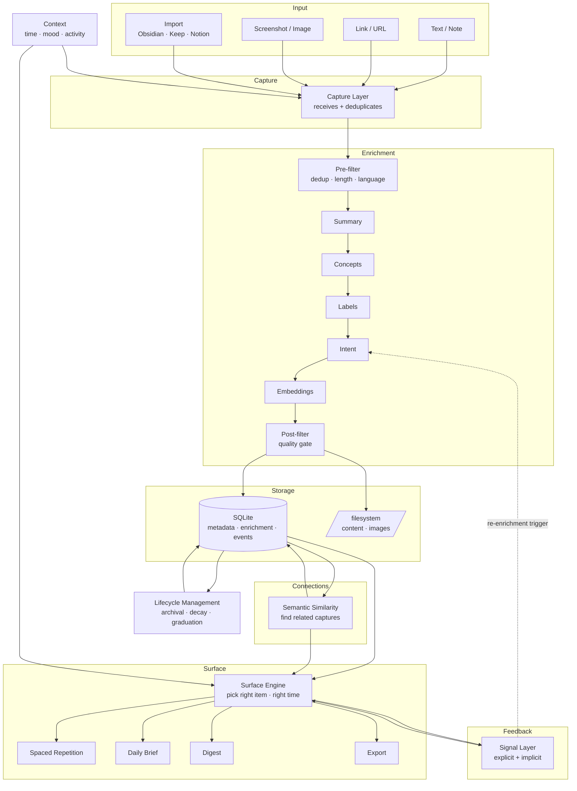
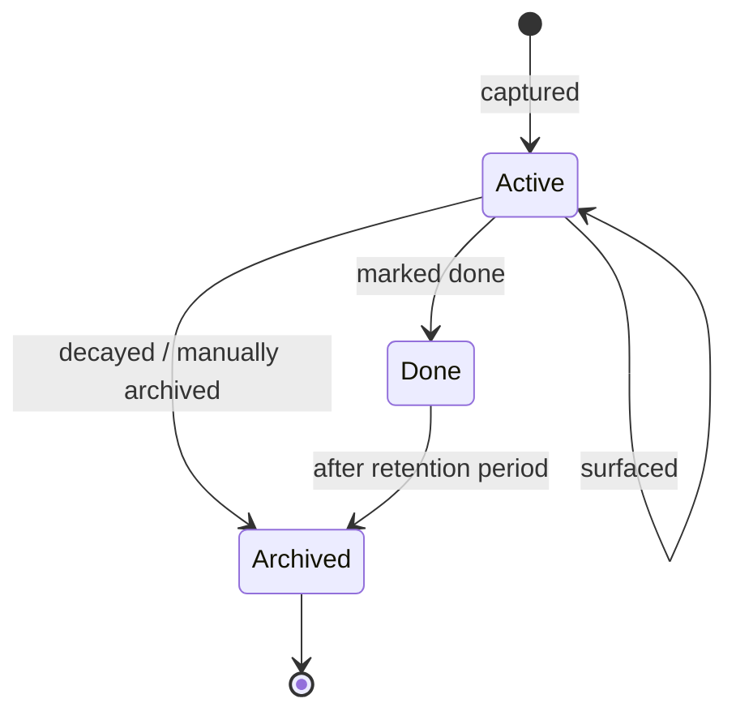
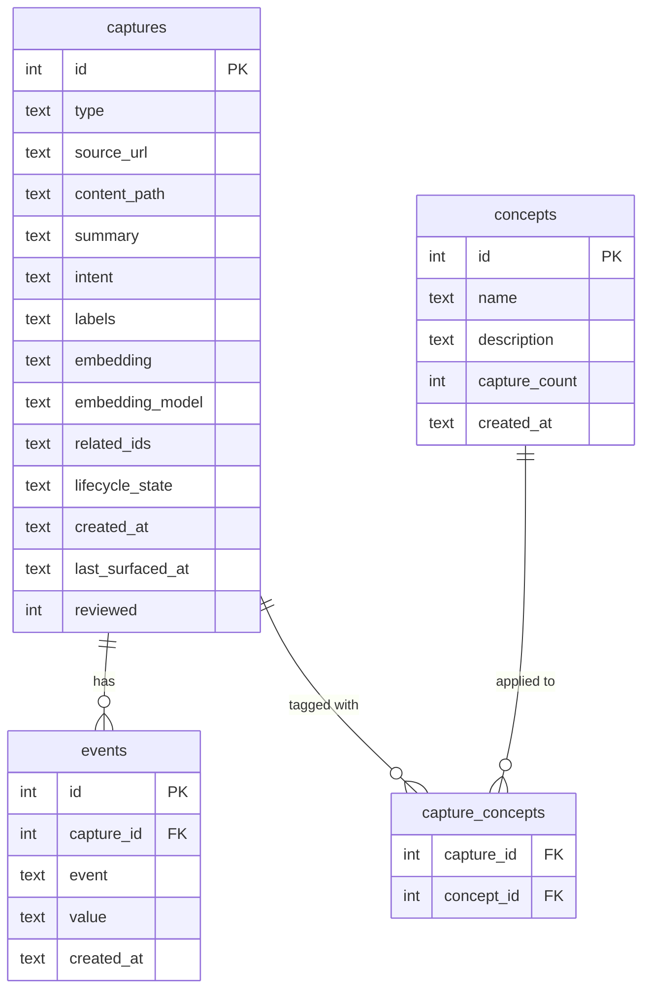
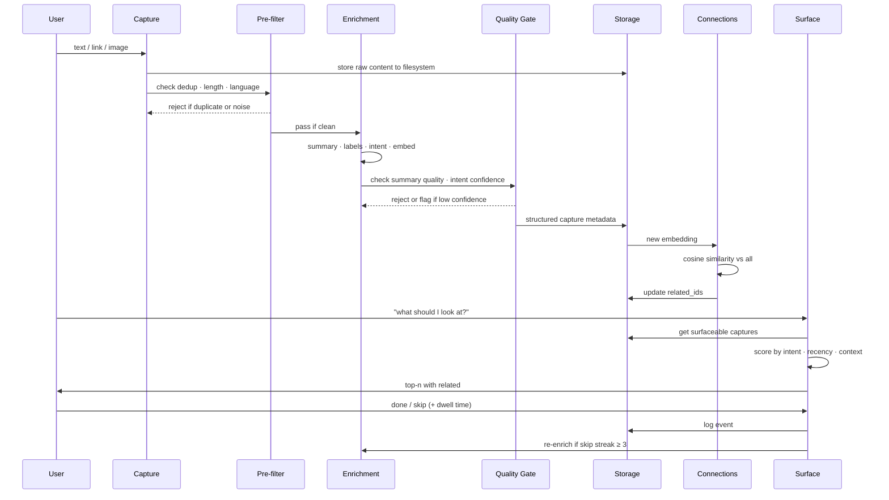

# Mycelium — Design Document

## Problem

Personal knowledge is broken at the retrieval end, not the capture end.

People save articles, take screenshots, bookmark links, and write notes constantly. The tooling for capture is abundant — browsers, notes apps, read-later lists. The problem is that nothing brings it back. Saved things become graveyards. The forgetting curve wins. When bored, the path of least resistance is algorithmic feeds that optimise for engagement, not for your actual interests.

The result: you know less than you've learned, you act on less than you've saved, and your attention is rented to platforms rather than invested in yourself.

**Three specific failures:**

1. **Scattered capture** — text in Keep, links in Pocket, screenshots in Camera Roll, long-form in Obsidian. No single place, no unified signal.
2. **No recall** — nothing surfaces saved content at the right time, in the right mood, with the right context.
3. **No connections** — two related ideas captured months apart never meet. Patterns in your own knowledge are invisible.

---

## Solution

**Mycelium** is a local-first personal knowledge agent. Like mycelium — the underground fungal network that connects trees and surfaces nutrients where they're needed — it sits beneath your daily attention, quietly connecting what you've captured and surfacing it back when it matters.

**Core loop:**

```
Capture → Enrich → Store → Connect → Surface → Feedback → (back to Enrich)
```

It is not a notes app. It does not replace Obsidian or Keep. It is the active layer on top — the thing that reads what you've saved and decides what to do with it.

**Design principles:**
- Local-first. Your knowledge stays on your machine.
- Capture everything, surface selectively.
- Bad enrichment is worse than no enrichment — quality gates matter.
- The system should get smarter from use, not just from configuration.

---

## Architecture



---

## Components

### Capture
**Responsibility:** Receive raw input across modalities. Store original material to filesystem immediately.  
**Inputs:** Text, URL, image file, import batch  
**Outputs:** Raw capture record + original material stored to filesystem  
**Failure mode:** Duplicate captures inflate the KB; noisy captures degrade enrichment quality  
**Key decision:** Capture is permissive — let everything in. Filtration happens in Enrichment, not here.

---

### Extraction & Enrichment
**Responsibility:** Transform raw captures into structured knowledge. The most critical component — bad output here corrupts everything downstream.

Two-stage filtration wraps enrichment:

**Stage 1 — Pre-filter (no LLM, cheap):**
- Dedup fingerprint check (URL hash + content hash + embedding similarity)
- Minimum length / language check
- Obvious spam rejection

**Stage 2 — Enrichment (LLM):**

| Sub-component | What it produces | Failure mode |
|---|---|---|
| Summary | 1-2 sentence distillation | Too generic → useless for search and connections |
| Concepts | Abstract ideas that span captures | Hallucination; derive from clustering, not per-capture generation |
| Labels | Broad user-visible categories | Model drift from user's own taxonomy |
| Intent | `learn / act / reference / ephemeral` | Wrong classification = item permanently misrouted |
| Embeddings | Semantic vector (model-versioned) | Incompatible across model changes |

**Stage 3 — Post-filter (quality gate):**
- Reject if summary is empty or generic
- Reject if intent confidence is below threshold
- Flag for manual review rather than silent drop

**Intent is the most consequential field.** A `learn` item classified as `ephemeral` is gone. Must be correctable.

---

### Storage
**Responsibility:** Single source of truth. Persist everything.

```
SQLite (mind.db)
├── captures     metadata, enrichment fields, lifecycle state
├── events       append-only signal log (surfaced, skipped, done, dwell)
└── concepts     concept vocabulary table (grows from tag clustering)

filesystem (storage/)
├── content/     {capture_id}.txt  — page text, OCR output
└── images/      {capture_id}.ext  — managed image files
```

**Key decisions:**
- SQLite for structured data and query flexibility; filesystem for raw material. No DB blobs.
- Concepts get their own table — not a JSON field — to enable querying.
- Orphan prevention: capture deletion must clean both DB and filesystem.
- `raw` text is not stored in DB for links/images — content_path points to filesystem.

---

### Connections
**Responsibility:** Find semantic relationships between captures using embedding similarity.  
**Inputs:** New capture embedding + all existing embeddings  
**Outputs:** `related_ids` list stored on each capture  
**Failure mode:** Surface-level similarity without conceptual link (false connections); vocabulary mismatch misses real connections  
**Scale limit:** Per-pair cosine scan degrades beyond ~1000 captures → migrate to sqlite-vec at that point.

---

### Context
**Responsibility:** Provide situational signal to Capture and Surface.  
**Signals:** Time of day, day of week, self-reported mood (optional dropdown)  
**Used by:** Surface (pick mood-appropriate items); Capture (timestamp context stored with capture)  
**Mood capture:** Optional dropdown in UI — no selection = no context signal. Time-of-day inferred automatically.

---

### Surface
**Responsibility:** Pick the right item at the right time and deliver it.

**Scoring inputs:** intent weight · time since last surfaced · novelty · context · feedback history  
**Outputs:**

| Mode | What it does |
|---|---|
| Spaced Repetition | `learn` items resurface at growing intervals |
| Daily Brief | Morning digest of `act` items + one `learn` |
| Digest | Weekly summary of what was captured and what's aging |
| Export | Push to Obsidian / markdown file |

**Invariant:** Surface must never return empty. If all items are below threshold, return best available.

---

### Feedback / Signal
**Responsibility:** Capture user behaviour and propagate it back into the system.

**Explicit signals:**
- `done` — item completed or learned
- `skip` — not now
- `correct` — user overrides intent/summary

**Implicit signals:**

| Signal | Threshold | Action |
|---|---|---|
| Dwell time < 2s + skip | — | Wrong item entirely |
| Dwell time > 15s + skip | — | Right content, wrong time |
| Skip streak | 3× | Trigger intent re-evaluation |
| Done on first surface | — | May have been wrong `act`; flag |

**Storage:** Raw events in `events` table. Aggregates computed on read.  
**Re-enrichment:** Skip streak ≥ 3 → re-run intent classification with behavioural context appended to prompt.

---

### Lifecycle Management
**Responsibility:** Manage how captures age, graduate, and retire.



**Decay rules (proposed):**
- `ephemeral` → auto-archive after 7 days
- `act` → surface daily; flag as stale after 30 days without done
- `learn` → spaced repetition; never auto-archive
- `reference` → surface on demand; archive after 1 year without access

---

### Correction
**Responsibility:** Allow explicit user override of enrichment fields.  
**What can be corrected:** intent, summary, labels, concepts  
**When:** At any point post-capture  
**Effect:** Updates Storage; resets feedback counters; re-runs embedding if summary changed

---

## Data Model



---

## Pipeline Flow



---

## Appendix: Key Tradeoffs and Decisions

### Embedding model versioning
**Decision:** Store `embedding_model` alongside every embedding vector.  
**Why:** Embeddings from different models live in incompatible vector spaces — cosine similarity across models is meaningless. When model changes, re-embed all captures.  
**Tradeoff:** Re-embedding is expensive but unavoidable. Mixing model versions silently would corrupt connections.

### Filtration gate placement (two-stage)
**Decision:** Pre-filter (cheap, no LLM) before enrichment; post-filter (quality gate) after enrichment.  
**Why:** Can't filter on quality without understanding content, but shouldn't waste LLM compute on obvious garbage.  
**Tradeoff:** Two passes adds complexity. The alternative (single gate after enrichment) wastes compute on noise; single gate before enrichment misses quality failures.

### Raw content storage (filesystem, not DB)
**Decision:** Page text and images go to `storage/content/` and `storage/images/`, not SQLite.  
**Why:** Page content can be 50k+ characters. Inline in DB means every query drags that weight. SQLite is the hot path for scoring, surfacing, and feed queries.  
**Tradeoff:** Orphan risk on deletion. Mitigated by a single `delete_capture()` function that cleans both.

### Concepts: derive, don't generate
**Decision:** Don't extract concepts per-capture. Start with tag clustering (Option C); graduate to constrained vocabulary (Option B) as KB grows.  
**Why:** Per-capture concept extraction hallucinates. LLM has no grounding when looking at one item in isolation. Clustering over real accumulated data reduces hallucination surface significantly.  
**Tradeoff:** Concepts are unavailable until enough tags accumulate. Acceptable — wrong concepts are worse than no concepts.

### Deduplication fingerprint
**Decision:** Three-layer check — URL hash (exact) + content hash (exact) + embedding similarity threshold (fuzzy).  
**Why:** URL hash misses same content at different URLs. Content hash misses paraphrases. Embedding similarity catches near-duplicates but needs the other two to avoid false positives.  
**Tradeoff:** Three checks add latency at capture time. Worth it — duplicates degrade KB quality permanently.

### SQLite over specialised stores
**Decision:** SQLite for all structured data until query patterns are known.  
**Why:** Query patterns are unknown early. SQLite is flexible, requires no infrastructure, and handles the expected load.  
**Migration trigger:** Embedding cosine scan degrades beyond ~1000 captures → add sqlite-vec extension. Schema stays the same, scan becomes indexed.

### Mood/context capture
**Decision:** Optional dropdown in UI. No selection = no context signal. Time-of-day inferred automatically.  
**Why:** Forced mood capture adds friction and will be skipped. Optional preserves signal quality — only captured when user is willing.  
**Tradeoff:** Sparse signal early. Time-of-day inference compensates until enough explicit mood data accumulates.
