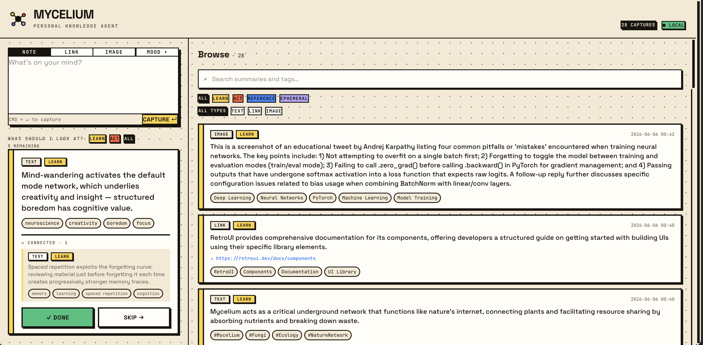

# Mycelium

**A local-first personal knowledge agent that captures, connects, and surfaces what matters — when it matters.**



🚀 **[Live demo](https://huggingface.co/spaces/build-small-hackathon/mycelium)** · 📹 **[Demo video](https://www.youtube.com/watch?v=Kr7LxRm0JBs)** · 📓 **[Field Notes](https://huggingface.co/blog/build-small-hackathon/mycelium)**

---

## The Problem

Everyone saves things. Nobody revisits them. Screenshots, bookmarks, notes-to-self — all gone dark in a week. The capture habit exists. The recall loop doesn't.

Mycelium fixes the recall loop.

---

## What It Does

- **Capture** — notes, links, images. Each processed by a local LLM into a structured summary with intent classification (`learn` / `act` / `reference` / `ephemeral`) and semantic tags.
- **ASK** — semantic search across your knowledge base with LLM synthesis, gap analysis, Feynman self-testing, and learning arc.
- **BRIEF** — daily digest with synthesis across captures and a weekly thread showing how your thinking evolved.
- **REVIEW** — spaced repetition (SM-2) targeting specific claims from your own notes — not generic flashcards.
- **GRAPH** — visual map of how your ideas connect via embedding similarity.

---

## How It Works

```
Capture → LLM enrichment → Embed → Connect → Surface → Review
```

1. Paste text, drop a URL, or upload an image
2. Local LLM extracts summary, tags, intent, claims, and a recall question
3. `BAAI/bge-base-en-v1.5` embeds the summary into a 768-dim vector
4. Related captures link automatically via cosine similarity
5. Surface engine resurfaces the right item at the right time via intent + recency scoring
6. Spaced repetition (SM-2) schedules review of what you should remember

Everything runs locally. No cloud APIs, no data leaving your machine.

---

## Stack

| Layer | Local dev | HF Space |
|---|---|---|
| Backend | FastAPI + SQLite | FastAPI + SQLite + Gradio (ZeroGPU) |
| LLM | LM Studio (OpenAI-compat) | `nvidia/Nemotron-Mini-4B-Instruct` |
| Vision | LM Studio (multimodal) | `Qwen/Qwen2.5-VL-7B-Instruct` |
| Embeddings | `BAAI/bge-base-en-v1.5` | `BAAI/bge-base-en-v1.5` |
| Frontend | React + TypeScript + Vite + Tailwind CSS | Same (served by FastAPI) |

---

## Setup

### Requirements

- Python 3.11+
- Node 18+
- [LM Studio](https://lmstudio.ai) with a chat model and `BAAI/bge-base-en-v1.5` loaded

### Backend

```bash
python -m venv .venv
source .venv/bin/activate
pip install -r requirements.txt

python -c "from db import init_db; init_db()"
uvicorn main:app --port 8000
```

### Frontend (dev)

```bash
cd frontend
npm install
npm run dev
```

### Frontend (production build)

```bash
cd frontend
npm run build
# Output goes to ../static/, served automatically by FastAPI
```

Open [http://localhost:8000](http://localhost:8000).

### Seed data (optional)

```bash
python seed.py  # populates 22 engineering captures across a week
```

---

## Project Structure

```
.
├── main.py          # FastAPI app — all API endpoints
├── lm.py            # Unified LLM interface (LM Studio + HF Transformers)
├── db.py            # SQLite schema + all queries
├── surface.py       # Intent-weighted surfacing + pick logic
├── config.py        # Model names, paths, auto-detects HF Spaces
├── seed.py          # Demo seed data (22 engineering captures)
├── requirements.txt
├── FIELD_NOTES.md   # Build post-mortem
├── DESIGN.md        # Architecture decisions
├── frontend/        # React + TypeScript + Vite
│   └── src/
│       ├── App.tsx
│       ├── api.ts
│       ├── types.ts
│       └── components/
│           ├── CaptureBar.tsx
│           ├── Feed.tsx, Browse.tsx, Card.tsx
│           ├── AskScreen.tsx
│           ├── BriefScreen.tsx
│           ├── ReviewScreen.tsx
│           └── GraphView.tsx
└── static/          # Built frontend (served by FastAPI)
```

---

---

Built by [@ajit3259](https://github.com/ajit3259) · Submitted to [Build Small Hackathon 2026](https://huggingface.co/spaces/build-small-hackathon)
